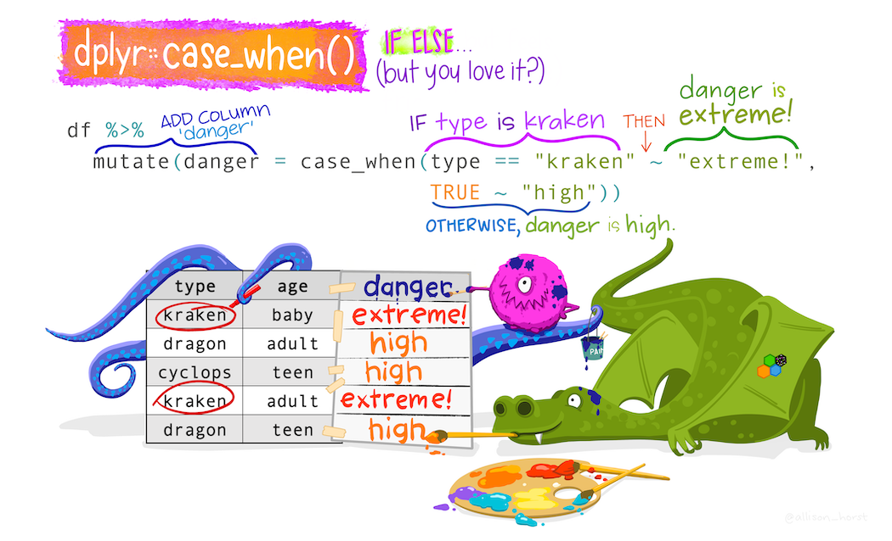

```{r setup, include=FALSE}
knitr::opts_chunk$set(echo = TRUE)
```

Welcome to worksheet 5! This worksheet was designed to allow you to practice what was covered in the assigned readings & lectures/recordings. The labs problems will be more challenging than those in the worksheet, and the worksheet questions will help prepare you for them. Time will be provided to work on the worksheets in small groups during lecture, however it is not expected that you will complete the worksheet in this time. You are expected to spend some independent time working on the worksheet after lecture.

<mark>To ensure you do not break the autograder remove all code for installing packages (i.e., DO NOT have `install.packages(...)` or `devtools::install_github(...)` in your homework!</mark>

**Worksheets are due on Saturdays at 6 pm, and must be submitted as `.Rmd` file to Gradescope.**

### Worksheet mechanics

-   **There is autograding in this lab, so please do not move or rename this file. Also, do not copy and paste cells, if you need to add new cells, create new cells via the "Insert a cell below" button instead.**

Run the cell below to load the libraries needed for this worksheet, and to check your answers as you go!

```{r}
library(nycflights13)
library(palmerpenguins)
library(repurrrsive)
library(readr)
library(dplyr)
library(purrr)
library(tidyr)
library(testthat)
library(digest)
```

### Exercise 1

rubric={autograde:1}



*Illustration by Allison Horst*

Given the data set below, use `mutate` + `case_when` to selectively change the more verbose province names (i.e., "Alberta" & "British Columbia") to the acronyms (i.e., "AB" & "BC"). Bind the name `fixed` to the tibble you create.

```{r tags=c()}
fix_me <- tribble(
  ~province,             ~cities,
  "BC",                  "Victoria",
  "Alberta",             "Edmonton",
  "SK",                  "Regina",
  "British Columbia",    "Vancouver",
  "Alberta",             "Calgary",
  "BC",                  "Kelowna",
  "AB",                  "Lethbridge",
  "SK",                  "Saskatoon"
)

fix_me
fixed <- fix_me |>  
  mutate(province = #fixed the tibble to only include acronyms of the cities
    case_when(
      province == "British Columbia" ~ "BC", 
      province == "Alberta" ~ "AB", 
      TRUE ~ province #if cities are already in acronym, don't change
      )
  )

fixed
```

```{r}
. = ottr::check("tests/e1.R")
```

### Exercise 2

rubric={autograde:1}

Use the {tidyr} `drop_na` function to drop the rows in the {palmerpenguins} `penguins` data set that have NA's in the `body_mass_g` column. Bind the name `penguins_less_nas` to tibble you create.

```{r tags=c()}
penguins_less_nas <- penguins |> 
  drop_na(body_mass_g) #using tidyr's drop_na function to drop any NA values in teh body_mass_g column

penguins_less_nas
```

```{r}
. = ottr::check("tests/e2.R")
```

### Exercise 3

rubric={autograde:1}

Use the {tidyr} `drop_na` function to drop **all** the rows in the {palmerpenguins} `penguins` data set that have NA's in any column. Bind the name `penguins_no_nas` to tibble you create.

```{r tags=c()}
penguins_no_nas <- drop_na(penguins) #here i am dropping all the NA values in the entire dataset 

penguins_no_nas
```

```{r}
. = ottr::check("tests/e3.R")
```

### Exercise 4

rubric={autograde:1}


*Illustration by Allison Horst*

Working with the {nycflights13} `planes` data set, calculate the average number of seats for planes categorized by their `engine` type (do not use the `type` column). Also count the number of planes for each `engine` type. Return the results together in one tibble, and name the columns `avg_seats` and `planes`. Bind the name `engine_summary` to this tibble.

\*Hint: the {dply} function `n()` (with no arguements) will be useful to count the number of planes for each engine type.

```{r tags=c()}
engine_summary <- planes |> 
  group_by(engine) |> #group the dataset by engine typye
  summarize(avg_seats = mean(seats, na.rm = TRUE), #get the average number of seats per engine type and ignore the NA values
            planes = n() #count the number of instances of an engine type which is equal the total number of planes per engine
            )

engine_summary
```

```{r}
. = ottr::check("tests/e4.R")
```

### Exercise 5 (Optional - not graded)

*Solution posted at end of worksheet.*

Calculate the mean body mass and mean flipper length for each sex of the Gentoo penguins species in the {palmerpenguins} `penguins` data set. Name the columns you create `mean_body_mass_g` and `mean_flipper_length_mm`. Bind the name `gentoo_sex_size` to the tibble you create.

*Hint: return only the data for female and male penguins, you may need to use `drop_na` to do this.*

```{r tags=c()}
gentoo_sex_size <- penguins |> #using penguins data to create gentoo_sex_size variable
  filter(species == 'Gentoo') |> #filtering by the the penguins species type Gento
    drop_na(sex) |>  #get rid of any NA values that dont belong to any sex group
  group_by(sex) |> #grouping by penguin sex (F/M)
  summarize(mean_body_mass_g = mean(body_mass_g, na.rm = TRUE), #summarize the mean body_mass_g and mean flipper_length_mm per sex group
            mean_flipper_length_mm = mean(flipper_length_mm, na.rm = TRUE))

  

gentoo_sex_size
```

```{r}
. = ottr::check("tests/e5.R")
```

### Exercise 6 (Optional - not graded)

*Solution posted at end of worksheet.*


*Illustration by Allison Horst*

Re-write the for loop in base R code shown below (which calculates the standard deviation for the chemical columns in the `Pottery.csv` data set located at <https://vincentarelbundock.github.io/Rdatasets/csv/carData/Pottery.csv>) using an {purrr} `map_*` function such that you get equal output values, but so that the `map_*` function returns a data frame instead of a vector. Bind the name `pottery_sd_purrr` to the tibble you create.

This data set contains measurements of chemicals found in ancient pottery from four locations in Great Britain.

*Data set source: Hand, D. J., Daly, F., Lunn, A. D., McConway, K. J., and E., O. (1994) A Handbook of Small Data Sets. Chapman and Hall.*

```{r tags=c()}
# read in data and subset chemical columns
pottery <- read_csv("https://vincentarelbundock.github.io/Rdatasets/csv/carData/Pottery.csv") %>%
    select(Al:Na)

# calculate standard deviation for each column using a for loop
pottery_sd_loop <- vector("double", ncol(pottery))
for (i in seq_along(pottery)) {
    pottery_sd_loop[i] <- sd(pottery[[i]])
}
pottery_sd_loop

pottery_sd_purrr <- map_df(pottery, sd)

pottery_sd_purrr 
```

Congratulations! You are done the worksheet!!! Pat yourself on the back, and submit your worksheet to Gradescope!

### Exercise 5 Solution

```         
gentoo_sex_size <- penguins %>% 
    filter(species == "Gentoo") %>%
    drop_na(sex) %>%
    group_by(sex) %>%
    summarise(mean_body_mass_g = mean(body_mass_g, na.rm = TRUE),
             mean_flipper_length_mm = mean(flipper_length_mm, na.rm = TRUE))
```

### Exercise 6 Solution

```         
pottery_sd_purrr <- map_df(pottery, sd)
```
